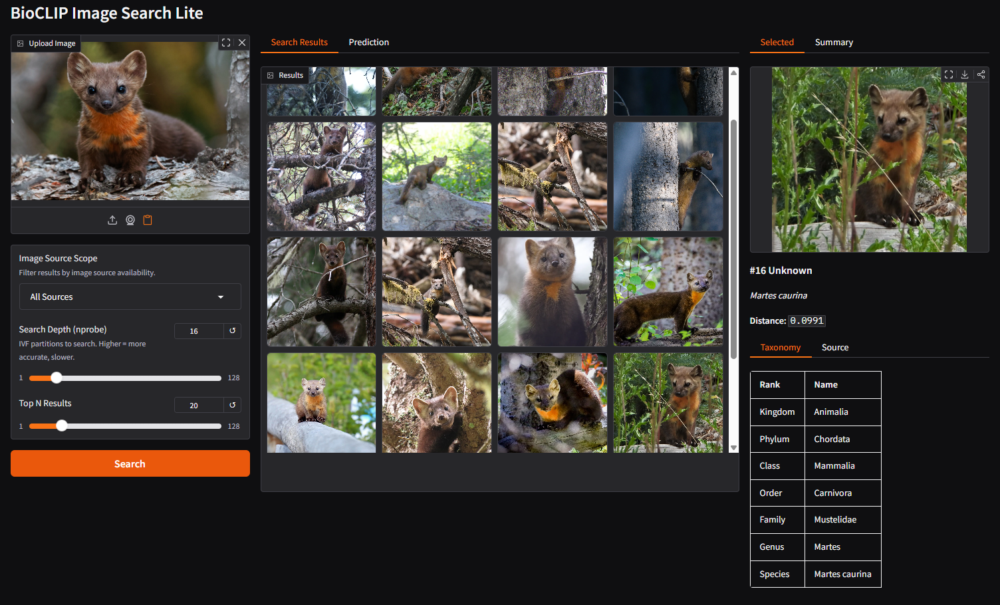
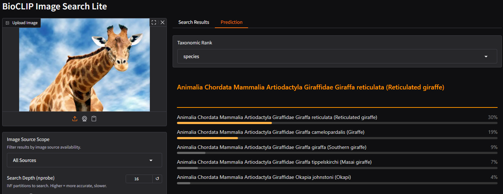
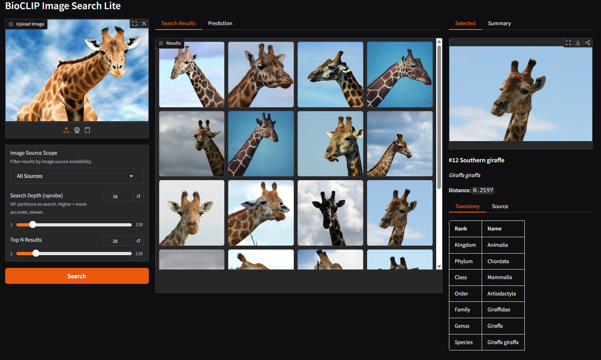
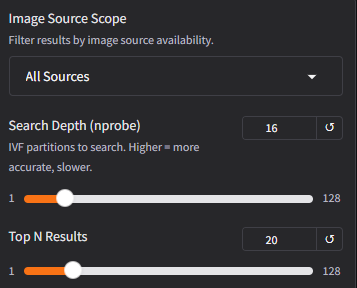

# BioCLIP Image Search Lite

> Upload a photo of an organism and find visually similar images across 200M+ biological images from the TreeOfLife-200M dataset.



## Learning Objectives

By the end of this tutorial, you will be able to:

1. Use the BioCLIP Image Search Lite web interface to find visually similar biological images and explore associated metadata (taxonomy, data source, occurrence records).
2. Understand how BioCLIP 2 embeddings and FAISS indexing enable fast similarity search over 200M+ images, and how search parameters (`nprobe`, `top N`, `scope`) affect results.

## Prerequisites

- **Internet connection**
- **A web browser.** No installation required for the web tutorial.
- **Prior knowledge:** None. We explain embeddings, vector search, and metadata as we go.

## Background

### What is BioCLIP Image Search Lite?

At this point you probably have already heard of or used the biological foundation model [BioCLIP 2](https://imageomics.github.io/bioclip-2/). 

BioCLIP Image Search Lite is a downstream application enabled by BioCLIP 2. Upload a photo of a plant, animal, or fungus and find the most visually similar images from a database of 200M+ biological images. The service is hosted on [Hugging Face Spaces](https://huggingface.co/spaces/imageomics/bioclip-image-search-lite) and open-sourced at [Imageomics/bioclip-image-search-lite](https://github.com/Imageomics/bioclip-image-search-lite).

It is "lite" because it does not store or distribute images. Instead, it relies on the URIs hosted on the original source servers and fetches them on demand. This reduces the total deployment footprint significantly, which reduces the deployment resource requirement and therefore makes the service more accessible.

The images come from the [TreeOfLife-200M dataset](https://huggingface.co/datasets/imageomics/TreeOfLife-200M), which aggregates records from sources like [GBIF](https://www.gbif.org/) (including iNaturalist observations), the [Encyclopedia of Life](https://eol.org/), and others. For full details on data sources and licensing information, see the [dataset card](https://huggingface.co/imageomics/bioclip-image-search-lite).

### How does it work?

```
Upload image --> BioCLIP 2 embedding --> FAISS search --> DuckDB metadata --> Results
```

1. **Embedding:** When you upload an image, BioCLIP 2 converts it into a list of 768 numbers called a **vector embedding**. Think of it as a numerical fingerprint that could capture aspects of the biological essence of what's in the image. Images that the model "perceives" as similar produce similar fingerprints.

2. **Search:** Your image's fingerprint is compared against 200+ million pre-computed fingerprints using [FAISS](https://faiss.ai/), a library for fast similarity search. Instead of comparing against every image one by one (which would take too long), FAISS organizes the fingerprints into ~65,000 groups (clusters) based on similarity, like sections in a library. The search only checks the most relevant sections.

3. **Metadata:** Once the most similar fingerprints are found, the system looks up their metadata (species name, taxonomy, data source, image URL) from a [DuckDB](https://duckdb.org/) database.

4. **Display:** The matching images are fetched directly from their original source URLs (iNaturalist S3, GBIF publishers, etc.). No images are stored locally.

### Understanding the search parameters

**Search Depth (nprobe):** Controls how many of the ~65,000 groups are checked during search. A higher value is more thorough but slightly slower. The default (16) works well for most queries. If you're not finding what you expect, try increasing this.

The chart below illustrates why increasing the Search Depth is often necessary.


**Left (Low Depth):** The user's image (Red X) falls just inside the blue region. However, the *true* best match (Green Star) sits just across the border in the neighboring grey region. Because the system is set to look in only one region, it hits a "hard wall" and misses the best match.

**Right (High Depth):** By increasing the search depth, the system is allowed to check neighboring regions. It successfully crosses the border and finds the Green Star.

> **Note:** This visualization uses a simple 2D map for clarity. The actual search operates in 768-dimensional space, where "borders" are much harder to define. This makes it even more important to check multiple neighboring groups to ensure you don't miss a relevant result.

**Top N Results:** How many similar images to return. More results take longer because each result requires fetching the image from its source URL.

**Scope:** Filters which images are eligible for results. The current index contains the GBIF and EOL partitions of the TreeOfLife-200M dataset. FathomNet and BIOSCAN sources will be added in a future update.

| Scope | Images | Description |
|-------|--------|-------------|
| All Sources | 234M | Everything in the database |
| URL-Available Only | 234M (99.99%) | Only results with fetchable source URLs |
| iNaturalist Only | 135M (58%) | iNaturalist observations via AWS Open Data |
| BioCLIP 2 Training | 206M (88%) | Records used in BioCLIP 2 model training |

## Steps

### Step 1: Open the application

Navigate to the live demo:

**[BioCLIP Image Search Lite on Hugging Face Spaces](https://huggingface.co/spaces/imageomics/bioclip-image-search-lite)**

> **Note:** If the Space has been sleeping (inactive for 48 hours), it may take a few minutes to wake up and load the data files. You'll see a loading screen during this time.

The interface has three panels:

- **Left:** Image upload, search controls (scope, nprobe, top N)
- **Middle:** Search results gallery and BioCLIP 2 predictions
- **Right:** Detailed view of a selected result (taxonomy, source info)

### Step 2: Upload an image and review predictions

Upload a photo of an organism. As soon as the image loads, BioCLIP 2 generates a **prediction**, its best guess at the taxonomy of the organism. Switch to the **Prediction** tab in the middle panel to see it.



Try changing the **Taxonomic Rank** dropdown to see predictions at different levels (kingdom, phylum, class, order, family, genus, species). 

### Step 3: Search for similar images

Click the **Search** button. The system will:

1. Use the BioCLIP 2 embedding from your uploaded image
2. Search the FAISS index for the most similar vectors
3. Look up metadata for each match
4. Fetch the result images from their source URLs

The gallery displays the most similar biological images found across the database.

### Step 4: Explore a result

Click on any image in the gallery. The right panel shows the selected image with full taxonomy and source details.



Details include:

- **Taxonomy:** Full classification from kingdom down to species
- **Source:** Where the image comes from (GBIF, EOL, etc.) with a direct link to the occurrence record on GBIF if available
- **Distance:** How similar the match is (lower = more similar)

### Step 5: Adjust search parameters



Try different settings to see how they affect results:

- **Increase Top N** to 50 or 100 to see a wider variety of matches
- **Increase nprobe** to 32 or 64 for more thorough (but slower) search
- **Change Scope** to "iNaturalist Only" to see only results from iNaturalist's research grade data, or "BioCLIP 2 Training" to limit to images that were used for BioCLIP 2 training. 

> **Tip:** Adjusting nprobe or top N after the initial search reuses the cached embedding. No need to re-upload or re-process the image.

## Bonus: Running it yourself

A key strength of this system is that FAISS enables sub-second similarity search over 200+ million vectors on commodity hardware, with no GPU required. The entire service can run on a personal laptop, given abundant disk storage.

Beyond this application, you can train your own FAISS index to perform similarity search over any set of embeddings. These could be image embeddings from [BioCLIP 2](https://huggingface.co/imageomics/bioclip-2), text embeddings from [BioCap](https://huggingface.co/imageomics/biocap), or embeddings from other multi-modality models. FAISS is model-agnostic: as long as you have a collection of vectors, it can index and search them efficiently.

### Compute artifacts

| Component | Size | Description |
|-----------|------|-------------|
| FAISS index | ~5.5 GB | 234M pre-computed BioCLIP 2 vector embeddings, organized into ~65,000 clusters for fast approximate nearest-neighbor search |
| DuckDB metadata | ~14 GB | Taxonomy, source provenance, and image URLs for all 234M records |
| Model weights | ~2.5 GB | BioCLIP 2 vision model, downloaded automatically on first run from [HuggingFace](https://huggingface.co/imageomics/bioclip-2) |
| **Total disk** | **~22 GB** | Full deployment footprint |

### Resource requirements

- **No GPU required.** The FAISS search and DuckDB lookup are CPU operations. The BioCLIP 2 embedding step benefits from a GPU (under 1 second vs. ~50 seconds on CPU), but a background server keeps the model loaded so this cost is paid only once.
- **RAM:** ~16 GB recommended. The FAISS index and DuckDB are memory-mapped, so actual memory usage is lower than the file sizes suggest.
- **Disk:** ~22 GB for all data files and model weights.

### Data availability

The pre-built FAISS index and DuckDB metadata are available for download from the [HuggingFace data repository](https://huggingface.co/imageomics/bioclip-image-search-lite):
You may access this with the `huggingface_hub` Python package built-in CLI called `hf`. (Instructions available [here](https://huggingface.co/docs/huggingface_hub/en/guides/cli)).

```bash
hf download imageomics/bioclip-image-search-lite --local-dir /path/to/data
```

### Local service (in development)

A command-line tool (`bioclip-search`) is currently in development to simplify local setup. It will provide:

- **CLI search:** `bioclip-search photo.jpg` for command-line usage with JSON, table, and CSV output containing the image metadata
- **Web UI:** The same Gradio interface shown on Hugging Face Spaces, running locally
- **Background server:** Keeps the model and index loaded in memory for fast repeated searches

For the latest status, see the [source code repo](https://github.com/Imageomics/bioclip-image-search-lite) on GitHub. 

