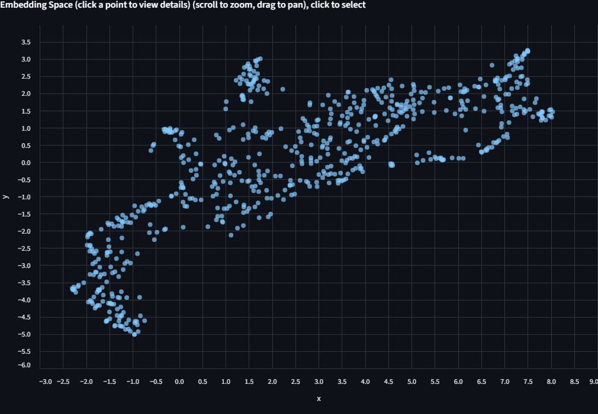
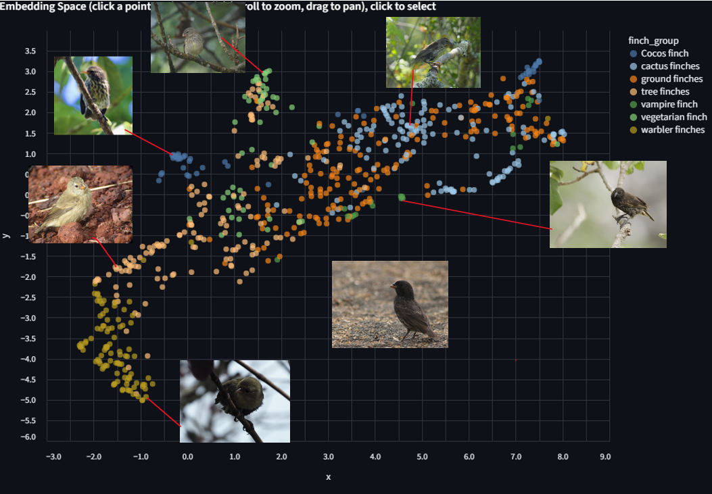
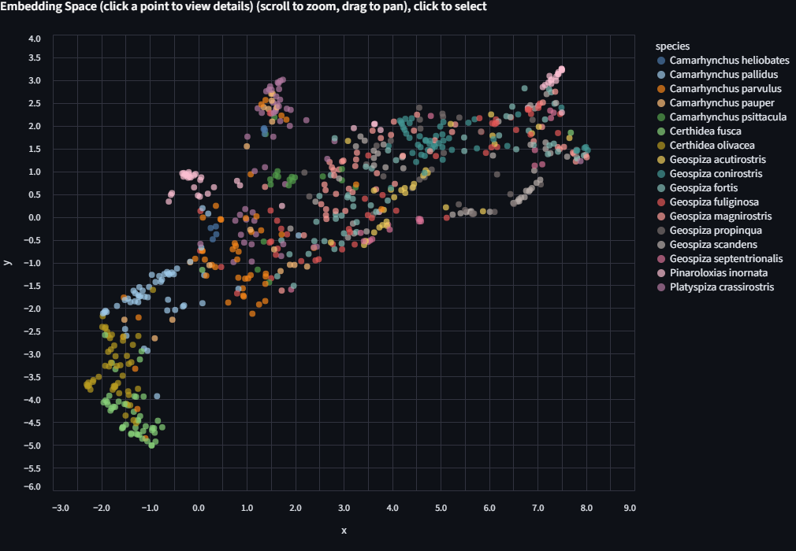
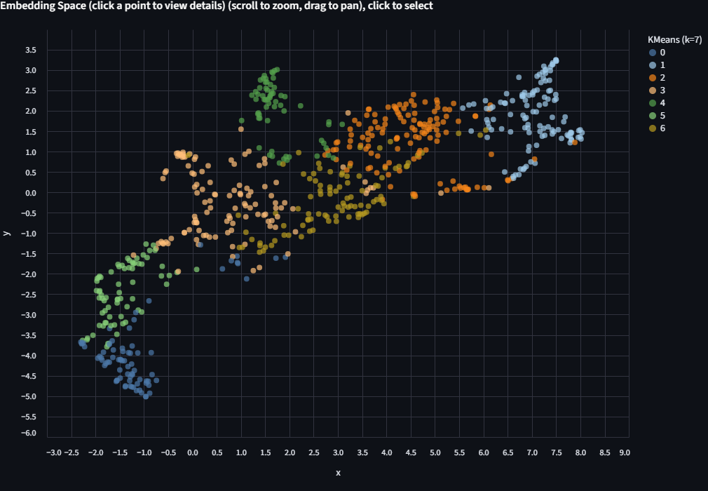
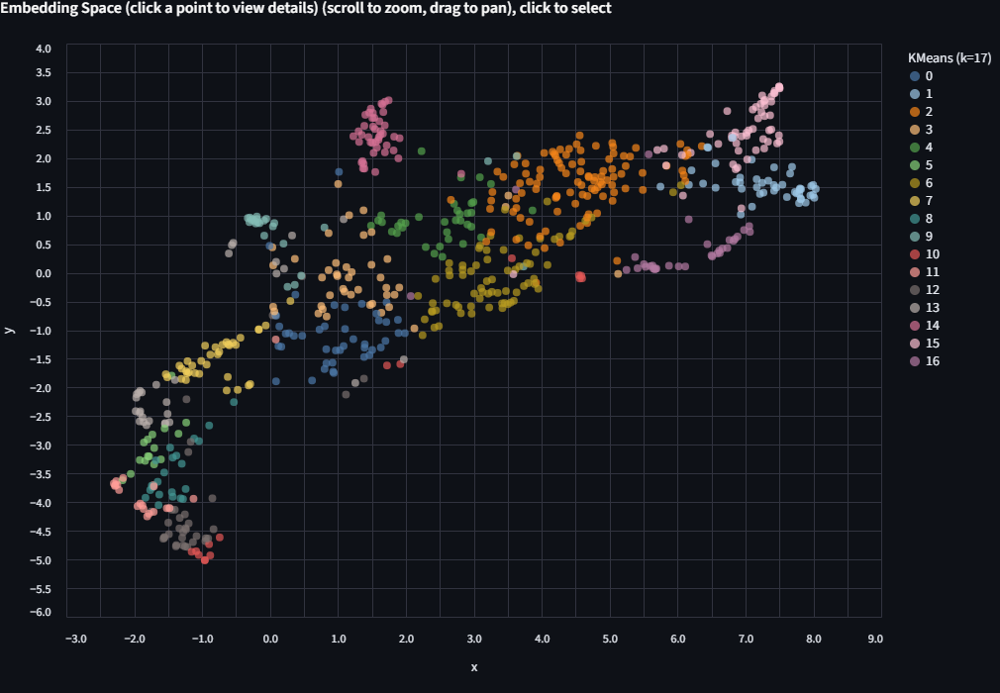
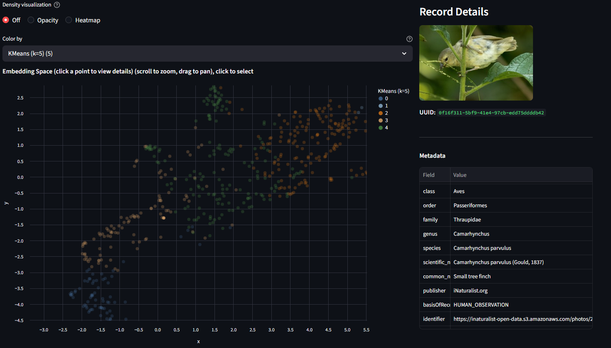
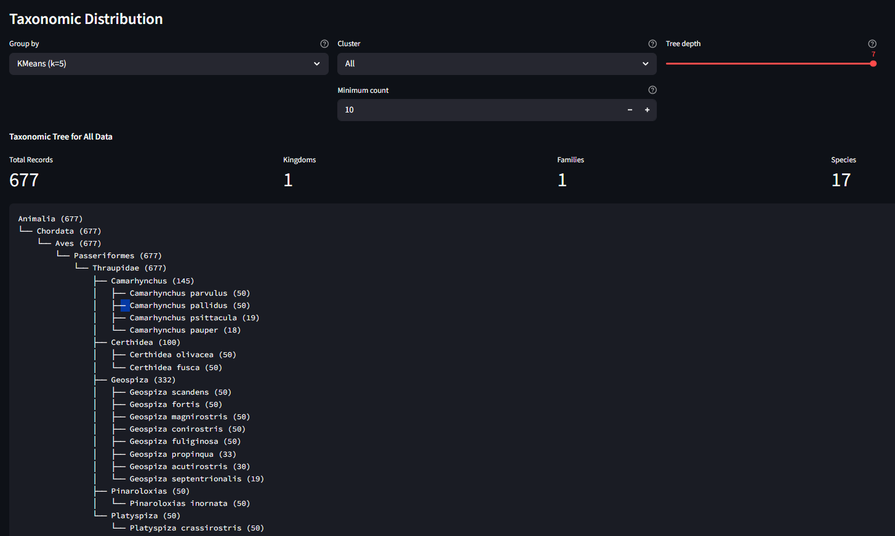

# Image Embedding Explorer

> Explore image embeddings interactively. Try different projections, cluster with KMeans, and see which images group together or apart.

## Learning Objectives

By the end of this tutorial, you will be able to:

1. Load precomputed image embeddings into the Precalculated Embeddings Explorer, apply cascading metadata filters, and project them to 2D with UMAP, t-SNE, or PCA.
2. Color the scatter plot by biological labels (species, genus, ecological group) to visually assess whether a model's embedding space reflects known biological structure.
3. Run KMeans clustering on the full high-dimensional embeddings and compare the resulting groups against ground-truth metadata.

## Prerequisites

- **Python version:** >= 3.10
- **Packages:** Installed automatically via `uv pip install` (see Setup).
- **Data:** A curated Darwin's finches dataset will be provided. An example dataset (`data/example_1k.parquet`) also ships with the repository.
- **Prior knowledge:** Basic comfort with a terminal. No machine learning background required; we explain embeddings as we go.

## Setup

In the [CyVerse Discovery Environment](https://de.cyverse.org/dashboard), launch **Jupyter Lab PyTorch GPU**.

Wait for "Launching VICE app: jupyter-lab-pytorch-gpu" to complete.

Click **Terminal** to open a new terminal session. This should place you in `~/data-store`.

Clone the repository:

```bash
git clone https://github.com/Imageomics/emb-explorer.git
cd emb-explorer
```

Install [uv](https://docs.astral.sh/uv/) for fast environment setup:

```bash
curl -LsSf https://astral.sh/uv/install.sh | sh
source $HOME/.local/bin/env
```

Create and activate a virtual environment:

```bash
uv venv --python 3.12
source .venv/bin/activate
```

Install the package with GPU support (CUDA 13.x on CyVerse):

```bash
uv pip install -e ".[gpu-cu13]"
```

Launch the **Precalculated Embeddings Explorer**:

```bash
streamlit run apps/precalculated/app.py \
  --server.headless true \
  --server.enableCORS false \
  --server.enableXsrfProtection false
```

Open the app in your browser: in your JupyterLab URL bar, note the prefix (e.g., `a12345abc` from `https://a12345abc.cyverse.run/lab`). In a new tab, navigate to:

```
https://<your-prefix>.cyverse.run/proxy/8501/
```

You should see the app UI.

## Background

### What is an image embedding?

A vision model like [BioCLIP 2](https://imageomics.github.io/bioclip-2/) looks at an image and produces a list of 768 numbers, a numerical fingerprint that captures what the model "sees." Images that the model "perceives" as similar get similar fingerprints. These fingerprints are called **embeddings**.

For example, using [pybioclip](https://imageomics.github.io/pybioclip/) you can generate an embedding for a single image in a few lines:

```python
from bioclip import TreeModel

model = TreeModel()
embedding = model.create_image_features_for_image("finch.jpg")
print(embedding.shape)
print(embedding[0, :5])
```

```
torch.Size([1, 768])
tensor([-0.0312,  0.0198,  0.0451, -0.0287,  0.0103])
```

The Image Embedding Explorer does this at scale for hundreds or thousands of images, then lets you visualize and cluster the results interactively.

### Why project to 2D?

We can't plot 768 dimensions on a screen. Dimensionality reduction methods (PCA, t-SNE, UMAP) compress those 768 numbers down to just x and y coordinates while trying to keep similar points close together. The resulting scatter plot shows the model's "view" of your data.

### Why cluster on the full dimensions?

KMeans clustering runs on the original 768-dimensional embeddings, not the 2D projection. This is important because 2D projections are lossy. Clusters found in 768-D may look overlapping in 2D, but they're genuinely distinct in the full space.

### Why does this matter for biology?

If you color the scatter by a biological label (species, genus, ecological group) and the groupings align, it suggests that the model has learned something biologically meaningful without being explicitly told those labels. Where the groupings *disagree* is often where the interesting biology is.

### The dataset: Darwin's finches

For this tutorial we use a curated set of **677 images spanning 17 species** of Darwin's finches, the iconic Galápagos adaptive radiation. The images are drawn from [TreeOfLife-200M](https://huggingface.co/datasets/imageomics/TreeOfLife-200M) and embedded with [BioCLIP 2](https://huggingface.co/imageomics/bioclip-2).

Each image carries taxonomic metadata (kingdom through species) plus a **finch group** label, the ecological/functional grouping that reflects how these finches diversified:

| Finch group | Species | Images | What they do |
|---|---:|---:|---|
| Ground finches | 4 | 180 | Seed-crushing beaks of varying sizes |
| Tree finches | 5 | 145 | Insect-probing beaks; includes the tool-using woodpecker finch |
| Cactus finches | 3 | 133 | Long beaks for cactus flowers and fruit |
| Warbler finches | 2 | 100 | Thin beaks for small insects; the most ancestral-looking |
| Cocos finch | 1 | 50 | Only finch on Cocos Island, 600 km from Galápagos |
| Vegetarian finch | 1 | 50 | Parrot-like beak for buds and fruit |
| Vampire finch | 1 | 19 | Feeds on the blood of boobies (yes, really lol) |

These 7 groups span 5 genera (*Geospiza*, *Camarhynchus*, *Certhidea*, *Platyspiza*, *Pinaroloxias*). The question we'll explore: **does BioCLIP 2's embedding space reflect these ecological groupings?**

Here is one representative image from each group. Pay attention to differences in beak shape, body size, and plumage across the groups:

<table>
  <tr>
    <td align="center" width="25%">
      <a href="https://inaturalist-open-data.s3.amazonaws.com/photos/108093646/original.jpg"></a><br>
      <a href="https://inaturalist-open-data.s3.amazonaws.com/photos/108093646/original.jpg"><b>Ground finch</b></a><br>
      <sub><i>Geospiza fortis</i><br>Stout, seed-crushing beak</sub>
    </td>
    <td align="center" width="25%">
      <a href="https://inaturalist-open-data.s3.amazonaws.com/photos/81257149/original.jpeg"></a><br>
      <a href="https://inaturalist-open-data.s3.amazonaws.com/photos/81257149/original.jpeg"><b>Tree finch</b></a><br>
      <sub><i>Camarhynchus parvulus</i><br>Small insect-probing beak</sub>
    </td>
    <td align="center" width="25%">
      <a href="https://inaturalist-open-data.s3.amazonaws.com/photos/38290777/original.jpg"></a><br>
      <a href="https://inaturalist-open-data.s3.amazonaws.com/photos/38290777/original.jpg"><b>Cactus finch</b></a><br>
      <sub><i>Geospiza scandens</i><br>Elongated beak for cactus flowers</sub>
    </td>
    <td align="center" width="25%">
      <a href="https://inaturalist-open-data.s3.amazonaws.com/photos/142041942/original.jpeg"></a><br>
      <a href="https://inaturalist-open-data.s3.amazonaws.com/photos/142041942/original.jpeg"><b>Warbler finch</b></a><br>
      <sub><i>Certhidea olivacea</i><br>Thin beak for small insects</sub>
    </td>
  </tr>
  <tr>
    <td align="center" width="25%">
      <a href="https://inaturalist-open-data.s3.amazonaws.com/photos/347677121/original.jpeg"></a><br>
      <a href="https://inaturalist-open-data.s3.amazonaws.com/photos/347677121/original.jpeg"><b>Cocos finch</b></a><br>
      <sub><i>Pinaroloxias inornata</i><br>Only finch on Cocos Island</sub>
    </td>
    <td align="center" width="25%">
      <a href="https://inaturalist-open-data.s3.amazonaws.com/photos/44704043/original.jpg"></a><br>
      <a href="https://inaturalist-open-data.s3.amazonaws.com/photos/44704043/original.jpg"><b>Vegetarian finch</b></a><br>
      <sub><i>Platyspiza crassirostris</i><br>Parrot-like beak for buds and fruit</sub>
    </td>
    <td align="center" width="25%">
      <a href="https://inaturalist-open-data.s3.amazonaws.com/photos/67970634/original.jpeg"></a><br>
      <a href="https://inaturalist-open-data.s3.amazonaws.com/photos/67970634/original.jpeg"><b>Vampire finch</b></a><br>
      <sub><i>Geospiza septentrionalis</i><br>Sharp beak; feeds on booby blood</sub>
    </td>
    <td></td>
  </tr>
</table>

See [Image Credits](#image-credits) for licensing and attribution.

## Step 1: Load Data

In the app sidebar, expand **Load Parquet** and enter the path to the Darwin's finches dataset:

```
data/darwin_finches.parquet
```

Click **Load File**. You should see:

> Loaded 677 records with N filterable columns

The filter panel will show the available metadata columns. You can optionally narrow to a single genus or finch group, but for this walkthrough we'll keep all 677 images.

## Step 2: Project to 2D

Expand **Project to 2D**. Select **UMAP**. Check **Use fixed seed** and set the seed to **614** so your layout matches the screenshots in this tutorial. Click **Project to 2D**.

A scatter plot appears. Each dot is one finch image, positioned by how BioCLIP 2 "sees" it. Points that are close together have similar embeddings. At this stage the dots are all one color because we haven't told the app how to label them yet.



## Step 3: Color by Biological Labels

Use the **Color by** dropdown above the scatter plot. Select `finch_group`.

The scatter is now colored by the 7 ecological groups listed above.



Look for clusters and patterns. Some things to consider as you explore:

- Which finch groups form distinct, tight clusters? Which overlap with others?
- Recall from the images above that ground finches, tree finches, and cactus finches have relatively similar body plans compared to the warbler finch or vegetarian finch. Does the embedding space reflect that?
- The ground finches (*Geospiza*) and cactus finches (*Geospiza*) share a genus. The tree finches (*Camarhynchus*) are a separate genus. Can you see this in the layout?

Now try coloring by `genus`, then by `species`. Each level reveals finer structure. Some closely related species (*G. fortis* and *G. fuliginosa*, for example) are famously hard to distinguish visually, and the embeddings may reflect that.



## Step 4: Run KMeans and Compare

Expand **KMeans Clustering**. You'll see "677 points (768-dim embeddings)", confirming that clustering happens in the full embedding space, not the 2D projection.

### Try k=7 (matching the 7 finch groups)

Set the number of clusters to **7** and click **Run KMeans**.

Switch the Color by dropdown to **KMeans (k=7)**. The scatter is now colored by the algorithm's unsupervised groupings.

Now switch Color by back to `finch_group` and compare. Try different values of k and see how the groupings change. Do they align with the ecological labels? Where do they diverge? There's no single right answer here.



### Try more k values

Run KMeans again with **k=17** (the number of species) or **k=5** (the number of genera). Each run appears as a separate entry in the Color by dropdown, so you can toggle between them without losing previous results.



!!! note "Color limit"
    The app uses up to 20 distinct colors. If k exceeds 20, colors will repeat and clusters become hard to distinguish. When that happens, try filtering to a subset of the data first.

!!! tip "Deriving k from your data"
    Select "From column" and choose a categorical column like `finch_group`. The app sets k to the number of unique values in that column, which is a natural starting point for comparison.

## Step 5: Inspect Points and the Taxonomy Tree

**Click any point** on the scatter plot. The right panel shows the image itself (fetched from the source URL in the metadata) along with all metadata fields: species, genus, finch group, publisher, basis of record, and more.



Try clicking points in different parts of the scatter. Compare what you see in the image with where the point is positioned. Are nearby points visually similar? Do outliers look different from their neighbors?

Scroll to the bottom for the **Taxonomic Distribution** panel. Use "Group by" to select a KMeans run, and "Cluster" to drill into a single cluster. The tree shows the biological composition of that cluster: which species and genera ended up grouped together.



## Step 6: Explore Further

A few prompts for further exploration:

- **Compare projection methods.** Re-project with PCA and then t-SNE. The three methods use different algorithms with default parameters (see [source code](https://github.com/Imageomics/emb-explorer) for details). Try each one and notice how the layout changes. Which one separates the finch groups most clearly?

- **Filter, then re-project.** Filter to only the *Geospiza* genus (the 8 species of ground, cactus, and vampire finches). Re-project with UMAP. Species-level structure that was hidden in the full dataset should become much clearer.

- **Try a biological question.** Run KMeans with k=2 on the *Geospiza* subset. Color by `finch_group` to see what axis the algorithm finds.

## Step 7: Explore from TreeOfLife-200M

The [TreeOfLife-200M-Embeddings](https://huggingface.co/datasets/imageomics/TreeOfLife-200M-Embeddings) dataset contains precomputed BioCLIP 2 embeddings covering the full [TreeOfLife-200M](https://huggingface.co/datasets/imageomics/TreeOfLife-200M) image collection. You can query it remotely using [DuckDB](https://duckdb.org/) to extract embeddings for any taxon, save the result as a parquet file, and load it directly into the Precalculated Embeddings Explorer.

### Setup

Install DuckDB and authenticate with Hugging Face:

```bash
uv pip install duckdb
```

```python
import duckdb, os

con = duckdb.connect()

# Authenticate with your Hugging Face token (required for dataset access)
# Option 1: from environment variable
con.execute(f"CREATE SECRET (TYPE HUGGINGFACE, TOKEN '{os.environ['HF_TOKEN']}')")

# Option 2: if you've logged in with `huggingface-cli login`
# import huggingface_hub
# con.execute(f"CREATE SECRET (TYPE HUGGINGFACE, TOKEN '{huggingface_hub.get_token()}')")
```

### Example: freshwater vs saltwater fish

The BioCLIP 2 paper shows that the model's embedding space separates freshwater fish from saltwater fish. We can try to recreate this by querying embeddings for two fish families known to occupy different habitats, adding a `habitat` label, and saving a balanced sample as a single parquet:

```python
glob = "hf://datasets/imageomics/TreeOfLife-200M-Embeddings/bioclip-2_float16/*.parquet"

# Freshwater family: Cichlidae (cichlids) — ~32k images in the dataset
# Saltwater family: Labridae (wrasses) — ~111k images in the dataset
# Take 1000 from each for a balanced, manageable dataset
con.sql(f"""
    COPY (
        WITH freshwater AS (
            SELECT *, 'freshwater' AS habitat
            FROM read_parquet('{glob}')
            WHERE family = 'Cichlidae'
            LIMIT 1000
        ),
        saltwater AS (
            SELECT *, 'saltwater' AS habitat
            FROM read_parquet('{glob}')
            WHERE family = 'Labridae'
            LIMIT 1000
        )
        SELECT * FROM freshwater
        UNION ALL
        SELECT * FROM saltwater
    ) TO 'freshwater_vs_saltwater.parquet'
""")

```

Load `freshwater_vs_saltwater.parquet` in the app, project with UMAP, and color by `habitat`. Do the two groups separate? Now try coloring by `genus` or `species` to see finer structure within each habitat group.

!!! note "SQL reserved words"
    The columns `order` and `class` are SQL reserved words. Always quote them in queries: `"order"`, `"class"`.

### More query ideas

You can query by any column in the dataset: taxonomy (`kingdom` through `species`), `basisOfRecord`, `img_type`, `publisher`, and more. See the [dataset card](https://huggingface.co/datasets/imageomics/TreeOfLife-200M-Embeddings) for the full schema.

For larger taxa, add a `LIMIT` or filter further to keep the dataset manageable, or just download the whole thing and filter down as needed:

```python
# Get up to 2000 Lepidoptera embeddings from human observations only
con.sql(f"""
    COPY (
        SELECT *
        FROM read_parquet('{glob}')
        WHERE "order" = 'Lepidoptera'
          AND "basisOfRecord" = 'HUMAN_OBSERVATION'
        LIMIT 2000
    ) TO 'lepidoptera_2k.parquet'
""")
```

### Load in the app

Back in the Precalculated Embeddings Explorer, enter the path to your downloaded parquet and click **Load File**. Then project, color, and cluster as before.

<!-- TODO: Add a section covering the Embed & Explore app (apps/embed_explore) for generating embeddings from a local image folder using BioCLIP 2. -->


## Chart Interaction Tips

The scatter plot is built with [Vega-Lite](https://vega.github.io/vega-lite/) via [Altair](https://altair-viz.github.io/). Here are the key interactions:

| Action | How |
|---|---|
| **Zoom in** | Scroll wheel up on the chart |
| **Zoom out** | Scroll wheel down |
| **Pan** | Click and drag on the chart background |
| **Reset zoom** | Double-click on the chart background |
| **Select a point** | Single-click on a data point (opens details in the right panel) |
| **Save chart as PNG** | Click the **"..."** menu in the top-right corner of the chart, then select "Save as PNG" |
| **View chart data** | Same **"..."** menu, select "View Source" to inspect the underlying data |

## Troubleshooting

| Problem | Solution |
|---------|----------|
| App doesn't load in the browser | Check that you replaced `<your-prefix>` with your JupyterLab URL prefix. The full URL should look like `https://a12345abc.cyverse.run/proxy/8501/`. |
| "Missing required 'uuid' column" | Your parquet doesn't match the expected schema. See the [data format docs](https://github.com/Imageomics/emb-explorer/blob/main/docs/DATA_FORMAT.md). |
| UMAP/t-SNE is very slow | Try PCA first (instant). If you need nonlinear structure, filter to a smaller subset before projecting. On CPU, UMAP on 10k+ points can take a minute. |
| Image preview shows nothing | The `identifier` column may be missing, null, or the URL may be unreachable. The scatter and clustering still work without it. |
| Port 8501 already in use | Another Streamlit app is running. Stop it first, or launch on a different port: `--server.port 8502`. |
| GPU out of memory | Filter to a smaller dataset, or select `sklearn` as the backend in the sidebar. |
| Blank page after long idle | CyVerse may time out the proxy. Refresh the browser tab. |

## Image Credits

Representative finch images used in this tutorial are from [iNaturalist](https://www.inaturalist.org/) observations included in the [TreeOfLife-200M](https://huggingface.co/datasets/imageomics/TreeOfLife-200M) dataset. All images are used under their respective Creative Commons licenses.

| Image | Species | Photographer | License |
|---|---|---|---|
| [Ground finch](https://inaturalist-open-data.s3.amazonaws.com/photos/108093646/original.jpg) | *Geospiza fortis* | ajott | [CC BY 4.0](https://creativecommons.org/licenses/by/4.0/) |
| [Tree finch](https://inaturalist-open-data.s3.amazonaws.com/photos/81257149/original.jpeg) | *Camarhynchus parvulus* | iNaturalist user | [CC BY-NC 4.0](https://creativecommons.org/licenses/by-nc/4.0/) |
| [Cactus finch](https://inaturalist-open-data.s3.amazonaws.com/photos/38290777/original.jpg) | *Geospiza scandens* | iNaturalist user | [CC BY-NC 4.0](https://creativecommons.org/licenses/by-nc/4.0/) |
| [Warbler finch](https://inaturalist-open-data.s3.amazonaws.com/photos/142041942/original.jpeg) | *Certhidea olivacea* | John G. Phillips | [CC BY-NC 4.0](https://creativecommons.org/licenses/by-nc/4.0/) |
| [Cocos finch](https://inaturalist-open-data.s3.amazonaws.com/photos/347677121/original.jpeg) | *Pinaroloxias inornata* | Dwight Baker | [CC BY-NC 4.0](https://creativecommons.org/licenses/by-nc/4.0/) |
| [Vegetarian finch](https://inaturalist-open-data.s3.amazonaws.com/photos/44704043/original.jpg) | *Platyspiza crassirostris* | bryncel | [CC BY-NC 4.0](https://creativecommons.org/licenses/by-nc/4.0/) |
| [Vampire finch](https://inaturalist-open-data.s3.amazonaws.com/photos/67970634/original.jpeg) | *Geospiza septentrionalis* | Andrés León-Reyes | [CC BY-NC 4.0](https://creativecommons.org/licenses/by-nc/4.0/) |

